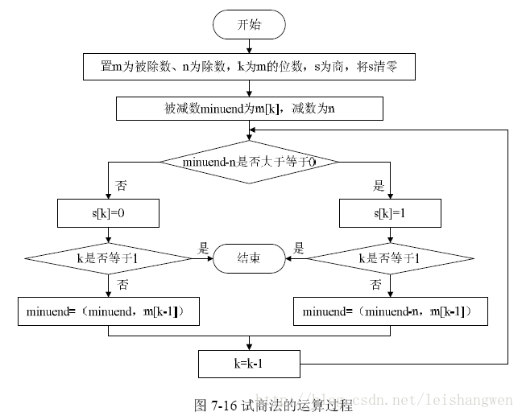
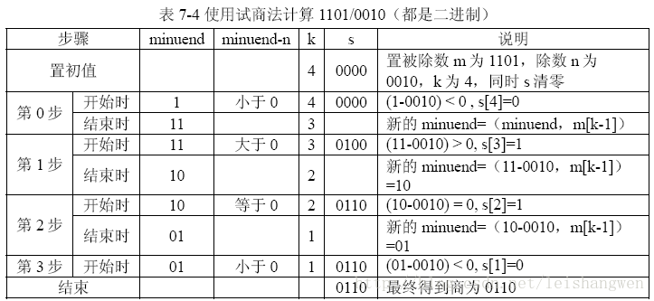

## 试商法求二进制除法
## 试商法
假设被除数是m，除数是n，商是s，被除数的位数是k，被减数minuend 其计算步骤如下(为了方便起见最低位为1开始计算)
1. 取被除数m的最高位m[k]为被减数minuend，使m[k]减去除数n，判断结果是否大于等于0，是,则s[k]=1，反之为0
2. 
    - 如果第1步的结果是小于，则s[k]=0(商的最高位)，判断k的值是否为1，如果为1，结束，表明商的最低为已经计算完毕。如果k不为1，则minuend = {minuend,m[k-1]},k=k-1（顺序执行，比如位数为32时，先m[31],后k=31）
    - 如果第1步的结果是大于等于0，则s[k]=1,判断k的值是否为1，如果为1，结束。如果k不为1，则minuend = {minuend - n,m[k-1]},k= k-1,产生新的被减数和k值

3. 新的被减数减去除数，重复前两步，知道k=1结束
4. 流程图
    - 
## 举个栗子
以1101/0010为例
    - 

参考链接(https://blog.csdn.net/leishangwen/article/details/39079817)